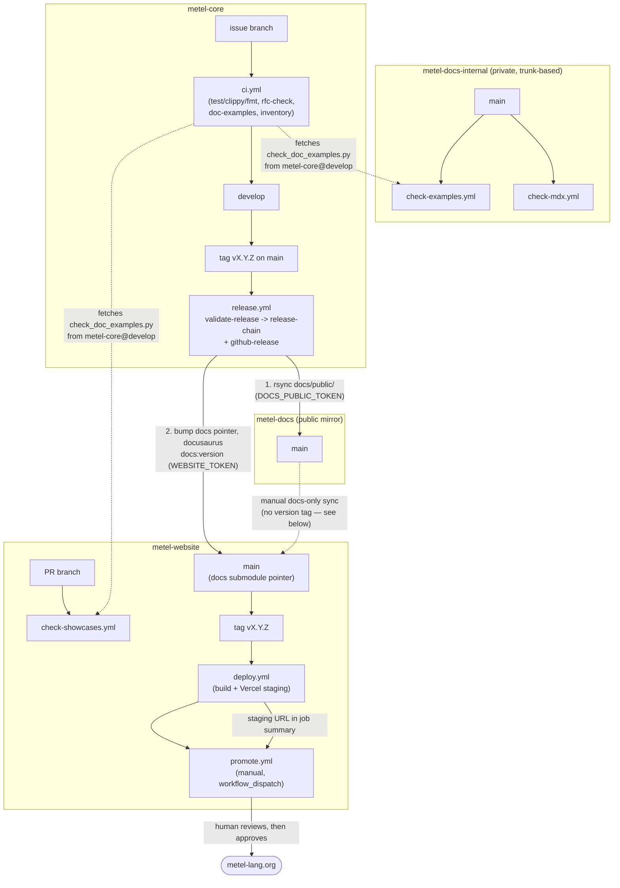

# Scripts and CI Processes

An inventory of every script and CI workflow across the three repositories this
project spans — `metel-core` (this repo), `metel-docs-internal`, and `metel-website`
— plus `metel-docs`, the public mirror none of them directly develop against but all
of them read from or write to. Nothing else currently lists all of this in one place
(metel-core#687): `RELEASING.md` covers the release chain specifically, `AGENTS.md`
covers the per-PR/release gates, but neither says what runs on an ordinary PR, what
the RFC tooling does, or which repo owns which secret, as a single system.

This doesn't replace those documents or duplicate their reasoning — it's the index of
*what exists*, so "what would break if I changed X" is a read, not a grep across three
repos.

## Keeping this current

Any pull request that adds, removes, or changes a workflow, a `tools/` script, or a
`.claude/commands/` slash command — in any of the three repos — updates this document
in the same pull request. This is the same discipline `AGENTS.md` already asks for the
changelog: reflected when the change lands, not reconstructed from history later.

`tools/check_inventory.sh` enforces the slice of this actually reachable from
metel-core's own CI: every workflow, `tools/` script, and slash command *in this repo*
must be named somewhere in this file, checked by the `inventory` job in `ci.yml` on
every PR. It cannot see `metel-docs-internal`'s or `metel-website`'s own workflow
directories — there's no cheap way for one private repo's CI to watch another's file
list on every push — so those two repos' slices rely on review catching a
new/changed workflow with no matching update here, the same way review already has to
catch a missing changelog entry that `tools/changelog-status.sh` can't see if the
underlying commit hasn't landed yet.

## The whole pipeline



Solid arrows are automated triggers or writes. Dashed arrows are either a runtime
fetch (the checker script) or the one manual path (below) that has no workflow at
all.

## metel-core

| Path | Trigger | Reads | Writes | Secret(s) |
|---|---|---|---|---|
| `.github/workflows/ci.yml` — `ci` job | push/PR to `develop`/`main` | this repo | — | — |
| `.github/workflows/ci.yml` — `rfc-check` job | push/PR to `develop`/`main` | `docs` submodule (metel-docs-internal) | — | `DOCS_REPO_TOKEN` (read-only) |
| `.github/workflows/ci.yml` — `doc-examples` job | push/PR to `develop`/`main` | `README.md`, `docs` submodule | — | `DOCS_REPO_TOKEN` |
| `.github/workflows/ci.yml` — `inventory` job | push/PR to `develop`/`main` | this repo's own workflows/tools/commands | — | — |
| `.github/workflows/release.yml` — `validate-release` | tag `vX.Y.Z` pushed | `docs` submodule | — | `DOCS_REPO_TOKEN` |
| `.github/workflows/release.yml` — `release-chain` | after `validate-release` | `docs` submodule | `metel-docs` main, `metel-website` main + tag | `DOCS_REPO_TOKEN`, `DOCS_PUBLIC_TOKEN`, `WEBSITE_TOKEN` |
| `.github/workflows/release.yml` — `github-release` | after `validate-release` | `docs` submodule | this repo's GitHub Releases | `DOCS_REPO_TOKEN`, built-in `GITHUB_TOKEN` |
| `tools/check_doc_examples.py` | invoked by `doc-examples`, and fetched at runtime by both other repos' checkers | any path of `.md`/`.mdx`/`.mtl` files passed on the CLI | stdout only | — |
| `tools/changelog-status.sh` | manual (`/ship-issue`, `/cut-release`) | `docs/public/release-notes/changelog.md`, git log | stdout only | — |
| `tools/check_inventory.sh` | invoked by `ci.yml`'s `inventory` job | this file, this repo's own workflows/tools/commands | stdout only | — |
| `.claude/commands/start-issue.md` | manual slash command | issue body, `develop` | new issue branch | — |
| `.claude/commands/ship-issue.md` | manual slash command | issue branch | PR to `develop`, fast-forward merge | — |
| `.claude/commands/cut-release.md` | manual slash command | `develop` | tag on `main`, triggers `release.yml` | — |
| `.claude/commands/gap-analysis.md` | manual slash command | milestone's open issues | edited/created issues | — |
| `.claude/commands/review-typechecker.md` | manual slash command | a typechecker/inference diff | review report | — |
| `.claude/commands/new-rfc.md` | manual slash command | `docs/public/rfcs/` | new draft RFC | — |
| `RELEASING.md` | — (process doc) | — | — | — |
| `AGENTS.md` | — (process doc) | — | — | — |

## metel-docs-internal

| Path | Trigger | Reads | Writes | Secret(s) |
|---|---|---|---|---|
| `.github/workflows/check-examples.yml` | push/PR to `main` | `public/getting-started`, `public/blog`, `public/reference`; the latest metel-core **release binary**; `tools/check_doc_examples.py` fetched live from metel-core `develop` | — | built-in `GITHUB_TOKEN` (public reads only) |
| `.github/workflows/check-mdx.yml` | push/PR to `main` | `public/getting-started`, `public/reference`, `public/release-notes`, `public/blog`, via `tools/mdx-check-site` | — | — |
| `public/rfcs/tools/rfc.py` | manual (`new`/`transition`/`supersede`/`check`/`index`) | `public/rfcs/` | `public/rfcs/` (moves files between lifecycle directories, edits frontmatter), `public/rfcs/INDEX.md` | — |
| `public/rfcs/PROCESS.md` | — (process doc) | — | — | — |

This repo is trunk-based (no `develop`/`main` split of its own) — every commit goes
straight to `main`, per its own `README.md`.

### What is deliberately not checked

`check_doc_examples.py` runs against `public/getting-started`, `public/blog`, and
`public/reference` (plus `README.md` on metel-core's side, and `src/showcases` on
metel-website's). Two directories holding a large number of ` ```metel ` fences are
excluded **by decision, not by oversight** — recorded here so neither reads as a gap
someone should close later:

**`public/release-notes/changelog.md`** — the changelog's genre is documenting
*rejections, known limitations, and before/after syntax transitions*, so it is the
document most likely to quote syntax that deliberately does not compile, including in
its newest entry. All three of its current fences are non-compiling by intent: bare
signatures with no bodies; an example labelled as accepted-but-wrong under a
then-known move-checker gap; and two conflicting `extend Handle: Drop` blocks, one
explicitly marked "rejected". Holding a historical record to "compiles against the
current binary" would mean either rewriting past entries or accumulating permanent
`expect-fail` markers on them.

*(An alternative was considered and not taken: check only the newest `## vX.Y.Z`
section, extracting it with the same regex `release.yml` already uses twice. It is a
no-op today — every existing fence sits in `v0.12.0`, one section behind the newest —
and each future release section would still need markers on its rejection examples.
Worth revisiting only if changelog examples start being written as ordinary working
code, which the genre argues against.)*

**`public/rfcs/`** — 676 fences across 136 files, describing proposed, superseded, and
refused syntax. An RFC at `0-draft` proposes syntax that does not exist yet; one at
`6-refused` documents syntax deliberately never built. Neither can compile, and both
are correct as written.

The distinction is what a reader *does* with the code. Spec, tutorials, quickstart,
intro, error-codes, and the showcases describe the current language and get copied, so
they must always compile. The blog is dated like the changelog but its examples are
also meant to be lifted, so it stays checked — a newcomer copying a broken example out
of "Introducing Metel" is worse than editing an archived post when syntax moves.

## metel-website

| Path | Trigger | Reads | Writes | Secret(s) |
|---|---|---|---|---|
| `.github/workflows/check-showcases.yml` | push/PR to `main` | `src/showcases/*.mtl`; the latest metel-core release binary; `tools/check_doc_examples.py` fetched live from metel-core `develop` | — | built-in `GITHUB_TOKEN` |
| `.github/workflows/deploy.yml` | tag `vX.Y.Z` pushed (normally by `release.yml`, but a tag pushed here directly triggers the identical pipeline) | this repo, including the `docs` submodule | Vercel **staging** deployment | `VERCEL_TOKEN`, `VERCEL_ORG_ID`, `VERCEL_PROJECT_ID` |
| `.github/workflows/promote.yml` | manual (`workflow_dispatch`, given a staging `deployment_url` + `tag`) | the named staging deployment | Vercel **production** alias (`metel-lang.org`) | `VERCEL_TOKEN`, `VERCEL_ORG_ID`, `VERCEL_PROJECT_ID` |

## Secrets, by repo

| Secret | Lives in | Scope |
|---|---|---|
| `DOCS_REPO_TOKEN` | metel-core | Read-only, `metel-docs-internal` only |
| `DOCS_PUBLIC_TOKEN` | metel-core | Write, `metel-docs` only |
| `WEBSITE_TOKEN` | metel-core | Write, `metel-website` only |
| `VERCEL_TOKEN` / `VERCEL_ORG_ID` / `VERCEL_PROJECT_ID` | metel-website | Vercel deploy access for this project |

No single credential spans more than one repository. `check-examples.yml` and
`check-showcases.yml` need no secret of their own for the cross-repo reads they do —
both `tools/check_doc_examples.py`'s source and metel-core's release binaries are
public, so the workflow's own built-in `GITHUB_TOKEN` covers both.

## What triggers what — worked examples

**A `tools/check_doc_examples.py` fix lands in metel-core.** It's live for
metel-core's own `doc-examples` job immediately (same repo). It's invisible to
`metel-docs-internal`'s `check-examples.yml` and `metel-website`'s
`check-showcases.yml` until it's merged to metel-core's `develop` branch specifically
— both fetch from `develop`, not `main`, precisely so a script fix doesn't wait a full
release cycle to reach them (see the comment in either workflow).

**A version tag `vX.Y.Z` is pushed to metel-core's `main`.** `release.yml` runs:
`validate-release` checks the changelog isn't still "in progress"; `release-chain`
mirrors `docs/public/` into `metel-docs`, then bumps `metel-website`'s `docs` pointer
and tags it; `github-release` builds the binary and publishes the GitHub Release —
independently of `release-chain`, so one failing doesn't block the other. The new tag
on `metel-website` is a real tag push, which is what triggers `deploy.yml` there
(Stage B) — not a synthetic dispatch, so `metel-website`'s own pipeline stays
independently testable by pushing a tag directly to it. `deploy.yml` builds once and
deploys to Vercel staging; production is `promote.yml`, always manual, since GitHub's
required-reviewer Environment protection needs a paid plan this org doesn't have — a
human running `promote.yml` after reviewing the staging URL is the approval step
instead.

**Only `metel-docs-internal` changed — no metel-core release is warranted.** Nothing
above moves automatically; there is no workflow for this path today. The manual
procedure, exercised directly rather than through a script:

1. Merge the docs-internal PR to its `main`.
2. Clone `metel-docs` fresh, `rsync -a --delete --exclude='.git'` the docs-internal
   repo's `public/` into it, commit (only if content actually changed), push to `main`
   — the same rsync `release-chain`'s `sync-docs` step runs, just without a release
   tag driving it.
3. In `metel-website`, bump the `docs` submodule pointer to that commit, run `npm run
   typecheck && npm run build` to catch anything the sync broke, commit and push to
   `main` directly (no `docusaurus docs:version` step — that only runs for a real
   minor release).
4. `npx vercel pull --environment=preview && npx vercel build && npx vercel deploy
   --prebuilt` to produce a staging deployment — the same three commands
   `deploy.yml` runs, from a local machine with the Vercel CLI already linked to the
   project (`.vercel/project.json`).
5. Read the actual build output under `.vercel/output/static/` to confirm the fix is
   really in it — Vercel's SSO/Deployment Protection on preview URLs makes a plain
   `curl` against the staging URL redirect to `vercel.com/sso-api` rather than show
   the page.
6. `npx vercel pull --environment=production && npx vercel promote <staging-url>
   --yes` — the same promotion `promote.yml` runs, manually.
7. `curl` `https://metel-lang.org` directly (production has no SSO protection) to
   confirm the change is actually live.

This path exists because it's genuinely been used, repeatedly, for docs-only fixes
that don't warrant a version bump — it just isn't automated anywhere, and until now
wasn't written down anywhere either.
